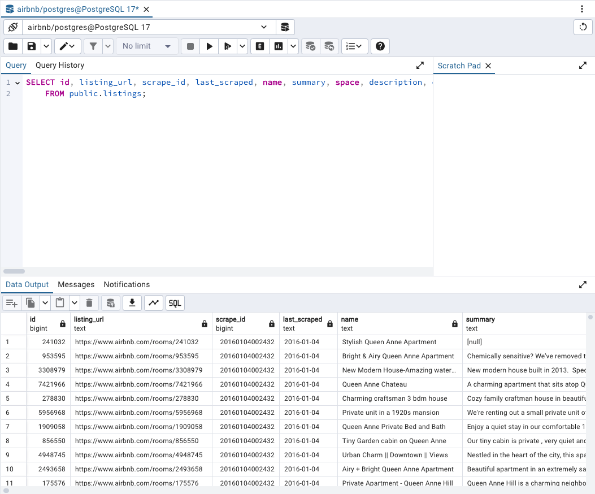
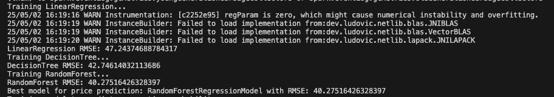
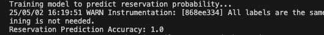
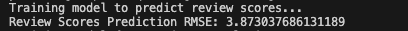
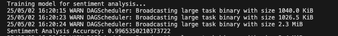
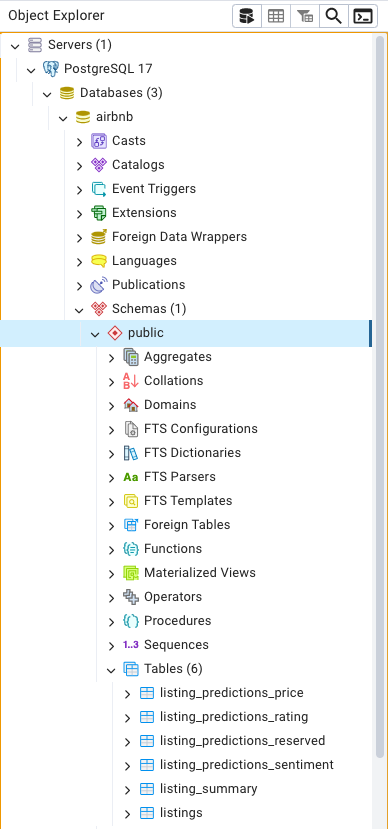

# Kata Spark

Ce projet implémente une pipeline de traitement de données Airbnb en utilisant PySpark, PostgreSQL et Hive. L'objectif est de traiter les données des annonces et des avis Airbnb, de les nettoyer, de les analyser et de les exporter pour des usages ultérieurs.

---

## **Architecture de la pipeline**
Voici un schéma illustrant l'architecture de la pipeline de traitement des données :


## **Problématique et Business Value**

### **Problématique**
Comment exploiter les données des annonces et des avis Airbnb pour optimiser les revenus des hôtes, améliorer l'expérience des utilisateurs et renforcer la compétitivité de la plateforme Airbnb ?

### **Business Value**

#### **1. Pour les hôtes :**
- **Optimisation des prix :**  
  Les données permettent aux hôtes d'analyser les prix moyens par quartier et type de chambre pour ajuster leurs tarifs et rester compétitifs.  
  Grâce à la prédiction des prix, ils peuvent maximiser leurs revenus tout en restant attractifs.
- **Amélioration des performances :**  
  Les données fournissent des insights sur les quartiers les mieux notés et les attentes des utilisateurs grâce aux avis et aux notes.  
  Les prédictions des notes des avis permettent aux hôtes d'identifier les points à améliorer pour obtenir de meilleures évaluations.
- **Gestion des réservations :**  
  Les données permettent d'anticiper les périodes de forte demande en analysant les disponibilités et les tendances des réservations.  
  La prédiction de la probabilité de réservation aide les hôtes à mieux gérer leur disponibilité.

#### **2. Pour les utilisateurs :**
- **Meilleure expérience utilisateur :**  
  Les utilisateurs peuvent consulter les annonces les mieux notées et les commentaires pour choisir des logements adaptés à leurs besoins.  
  L'analyse des sentiments des commentaires met en avant les annonces les mieux perçues par les anciens locataires.  
- **Recommandations personnalisées :**  
  Les utilisateurs peuvent filtrer les annonces par prix, type de chambre ou localisation.  
  Les prédictions permettent de recommander des annonces adaptées aux besoins spécifiques des utilisateurs.  

#### **3. Pour Airbnb :**
- **Amélioration de la plateforme :**  
  Les données permettent à Airbnb d'analyser les tendances des quartiers et des types de chambres pour améliorer ses algorithmes de recherche et de recommandation.  
  Les insights issus des prédictions renforcent la pertinence des recommandations.
- **Augmentation des revenus :**  
  Les données permettent d'identifier les opportunités de croissance en analysant les prix, les disponibilités et les performances des annonces.  
  Une meilleure adéquation entre les prix, les réservations et les attentes des utilisateurs conduit à une augmentation des transactions.

## **Ordre d'exécution des scripts**

### **1. Charger les données dans la base de données**
Le script `01_load_listings_to_db.py` charge les données des annonces Airbnb depuis le fichier CSV `listings.csv` dans une base de données PostgreSQL.

Voici une capture d'écran de la base de données PostgreSQL après le chargement des données :



```bash
python 01_load_listings_to_db.py
```

### **2. Ingestion des données des annonces dans Bronze**
Le script `02_ingest_listings_from_db.py` lit les données des annonces depuis la base de données PostgreSQL et les stocke dans le répertoire `bronze/listings/` au format Parquet, partitionnées par `year`, `month` et `day`.

```bash
python 02_ingest_listings_from_db.py
```

### **3. Préparation des fichiers de streaming pour les avis**
Le script `03_prepare_reviews_chunks.py` découpe le fichier CSV `reviews.csv` en plusieurs morceaux de 1000 lignes et les stocke dans le répertoire `data/reviews_chunks/`.

```bash
python 03_prepare_reviews_chunks.py
```

### **4. Simulation du streaming des avis**
Le script Bash `inject_reviews.sh` copie progressivement les fichiers découpés dans le répertoire `data/reviews_stream/`, simulant un flux de données.

```bash
bash inject_reviews.sh
```
[Regardez la vidéo de simulation du streaming](https://drive.google.com/file/d/1GUI3CaHCAl0RsaW7Ijx7vynJE0YydLE3/view?usp=sharing)

### **5. Traitement en streaming des avis**
Le script `04_stream_reviews.py` lit les fichiers dans `data/reviews_stream/` en mode streaming, ajoute des colonnes de partition (`year`, `month`, `day`) et écrit les données dans le répertoire `bronze/reviews/` au format Parquet.

```bash
python 04_stream_reviews.py
```
[Regardez la vidéo de simulation du streaming](https://drive.google.com/file/d/1RITeTYhvpEI6Xbuwk3Z_4ya3Ohn4vKze/view?usp=sharing)

### **6. Nettoyage et jointure des données**
Le script `05_transform_clean.py` :
- Nettoie les données des annonces et des avis (suppression des doublons, gestion des valeurs manquantes, normalisation des colonnes, conversion en double ($), suppression des colonnes inutiles).
- Effectue une jointure interne (`inner join`) sur la colonne `listing_id` entre les deux ensembles de données.
- Stocke les données jointes dans une table Hive `silver_joined`.

Exemple de code utilisé pour sauvegarder les données jointes dans la table Hive `silver_joined` :

```python
df_joined.write.mode("overwrite").saveAsTable("silver_joined")
```

```bash
python 05_transform_clean.py
```

### **7. Modélisation Machine Learning**
Le script `06_ml_model.py` effectue plusieurs prédictions en utilisant différents modèles de machine learning. Les données sont chargées depuis la table Hive `silver_joined` en utilisant la commande suivante :

```python
df = spark.sql("SELECT * FROM silver_joined")
```

Les résultats des prédictions sont ensuite sauvegardés dans le répertoire `gold/`.

#### **1. Prédiction du prix des annonces**
- **Objectif :** Prédire le prix (`price`) des annonces en fonction de leurs caractéristiques.
- **Modèles testés :**
  - Régression linéaire (`LinearRegression`)
  - Arbre de décision (`DecisionTreeRegressor`)
  - Forêt aléatoire (`RandomForestRegressor`)
- **Processus :**
  - Les modèles sont entraînés sur les données, et le modèle avec le plus faible RMSE (Root Mean Squared Error) est sélectionné.
- **Résultat :**
  - Les prédictions du meilleur modèle sont sauvegardées dans `gold/predictions_price/`.



#### **2. Prédiction de la probabilité de réservation**
- **Objectif :** Prédire si une annonce sera réservée ou non (`reserved`).
- **Modèle utilisé :**
  - Régression logistique (`LogisticRegression`)
- **Processus :**
  - Une colonne binaire `reserved` est créée (1 si `reviews_per_month > 0`, sinon 0).
  - Le modèle est entraîné pour prédire cette colonne en fonction des caractéristiques de l'annonce.
- **Résultat :**
  - Les prédictions sont sauvegardées dans `gold/predictions_reserved/`.



#### **3. Prédiction des notes des avis**
- **Objectif :** Prédire la note moyenne des avis (`review_scores_rating`) des annonces.
- **Modèle utilisé :**
  - Arbre de décision (`DecisionTreeRegressor`)
- **Processus :**
  - Le modèle est entraîné pour prédire les notes des avis en fonction des caractéristiques de l'annonce.
- **Résultat :**
  - Les prédictions sont sauvegardées dans `gold/predictions_rating/`.



#### **4. Analyse des sentiments des commentaires**
- **Objectif :** Analyser les sentiments des commentaires (`comments`) pour déterminer s'ils sont positifs ou négatifs.
- **Modèle utilisé :**
  - Naive Bayes (`NaiveBayes`)
- **Processus :**
  - Une colonne binaire `sentiment` est créée (1 si `review_scores_rating > 8`, sinon 0).
  - Les étapes suivantes sont appliquées :
    1. **Tokenization :** Les commentaires sont divisés en mots.
    2. **Suppression des mots inutiles :** Les mots comme "le", "et", "de" sont supprimés.
    3. **Vectorisation :** Les mots sont convertis en vecteurs numériques.
    4. **Classification :** Le modèle Naive Bayes est entraîné pour prédire les sentiments.
- **Résultat :**
  - Les prédictions sont sauvegardées dans `gold/predictions_sentiment/`.



#### **5. Résumé des données**
- **Objectif :** Sauvegarder les données jointes et nettoyées pour des analyses ultérieures.
- **Processus :**
  - Les données de la table Hive `silver_joined` sont sauvegardées dans `gold/listing_summary/`.

---

### **Exemple de structure des fichiers Gold**
Après l'exécution du script, les prédictions et les données enrichies sont sauvegardées dans les répertoires suivants :
- `gold/predictions_price/` : Prédictions des prix des annonces.
- `gold/predictions_reserved/` : Prédictions de la probabilité de réservation.
- `gold/predictions_rating/` : Prédictions des notes des avis.
- `gold/predictions_sentiment/` : Résultats de l'analyse des sentiments.
- `gold/listing_summary/` : Données jointes et nettoyées pour des analyses ultérieures.

```bash
python 06_ml_model.py
```

### **8. Export des données vers la base de données**
Le script `07_export_to_api.py` :
- Exporte les prédictions depuis le répertoire `gold/` vers des tables PostgreSQL :
  - `listing_predictions_price` : Prédictions des prix des annonces.
  - `listing_predictions_reserved` : Prédictions de la probabilité de réservation.
  - `listing_predictions_rating` : Prédictions des notes des avis.
  - `listing_predictions_sentiment` : Résultats de l'analyse des sentiments.
- Exporte également les données résumées depuis `gold/listing_summary/` vers la table PostgreSQL `listing_summary`.



### **Visualisation des données avec Power BI**

Une fois les données exportées depuis la zone Gold vers PostgreSQL, une connexion est établie entre la base de données et Power BI pour permettre des analyses avancées et des visualisations interactives. Voici quelques exemples de tableaux de bord créés avec Power BI pour explorer les données exportées :

- **Analyse des prix des annonces :** Visualisation des prédictions de prix par quartier et type de logement.
- **Tendances des réservations :** Analyse des probabilités de réservation et des périodes de forte demande.
- **Sentiments des avis :** Exploration des sentiments des commentaires pour identifier les annonces les mieux perçues.
- **Performance des annonces :** Suivi des notes moyennes et des performances globales des annonces.

Vous pouvez télécharger le fichier Power BI (.pbix) contenant ces visualisations [ici](  ).

De plus, les scripts SQL pour créer les tables nécessaires dans PostgreSQL sont disponibles dans le dossier `sql/`.

```bash
python 07_export_to_api.py
```

---

## **Dépendances**
Installez les dépendances nécessaires avec le fichier `requirements.txt` :

```bash
pip install -r requirements.txt
```

---

## **Structure du projet**

```plaintext
airbnb_pipeline/
├── bin/
│   └── inject_reviews.sh                # Script Bash pour simuler un flux de données des avis
├── data/
│   ├── listings.csv                     # Fichier source des annonces Airbnb
│   ├── reviews.csv                      # Fichier source des avis Airbnb
│   ├── reviews_chunks/                  # Répertoire contenant les morceaux d'avis découpés
│   └── reviews_stream/                  # Répertoire simulant un flux de données des avis
├── bronze/                              # Zone Bronze : Données brutes
│   ├── listings/                        # Données des annonces au format Parquet
│   └── reviews/                         # Données des avis au format Parquet
├── silver/                              # Zone Silver : Données nettoyées et jointes
│   └── joined/                          # Données jointes des annonces et des avis
├── gold/                                # Zone Gold : Données prêtes pour l'analyse et les prédictions
│   ├── predictions_price/               # Prédictions des prix des annonces
│   ├── predictions_reserved/            # Prédictions de la probabilité de réservation
│   ├── predictions_rating/              # Prédictions des notes des avis
│   ├── predictions_sentiment/           # Résultats de l'analyse des sentiments
│   └── listing_summary/                 # Résumé des données jointes
├── scripts/                             # Scripts Python pour chaque étape de la pipeline
│   ├── 01_load_listings_to_db.py        # Charger les annonces dans PostgreSQL
│   ├── 02_ingest_listings_from_db.py    # Ingestion des annonces dans la zone Bronze
│   ├── 03_prepare_reviews_chunks.py     # Découper les avis en morceaux pour le streaming
│   ├── 04_stream_reviews.py             # Traiter les avis en mode streaming
│   ├── 05_transform_clean.py            # Nettoyer et joindre les données
│   ├── 06_ml_model.py                   # Modélisation Machine Learning
│   └── 07_export_to_api.py              # Exporter les données vers PostgreSQL
└── requirements.txt                     # Liste des dépendances Python
```

---

## **Notes**
- Assurez-vous que PostgreSQL, Hive et PySpark sont correctement configurés avant d'exécuter les scripts.